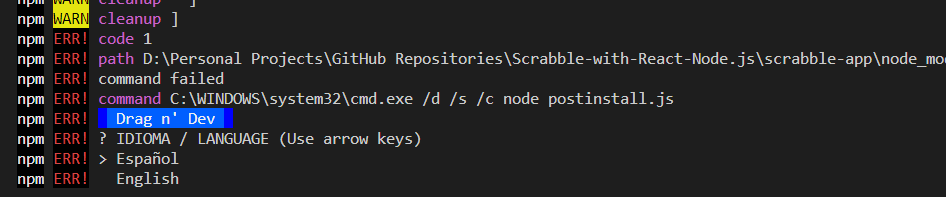

# Scrabble Computer Player

## Scrabble web app which allows Computer vs Player and Player vs Player written in React.js and Node.js

This is my final year project where I created an interactive user interface (UI) to play Scrabble against a computer player. The computer player was created using the data structure DAWG to store the lexicon, on the server side with Node.js, and then using a searching algorithm to test letter combination in the DAWG.  

* React Hooks API was used to create the UI.  
* Redux was used with React to keep track of the application state.  
* Using React Drag and Drop library, created a interactive UI for the user to play the game with ease and create a sense of familraity.  
* Node.js was used on the server side, to perform the searching quicker to allow to speed up the process.  
* Stored the dictionary in the data structure called DAWG for efficient searching.  
* Created a searching algorithm to test letter combination against the DAWG to find valid words.

## How it works and looks.  

The video has not captured it but, when dragging the tile, a transparent version of the tile is being dragged along.

https://github.com/JP0132/Scrabble-with-React-Node.js/assets/78804278/83db2ed2-2c74-44bf-b59d-87166db59f20

https://github.com/JP0132/Scrabble-with-React-Node.js/assets/78804278/0d213bbb-13eb-4891-a0f3-f2410a878ac2

## How to run.

### Prerequisites

* Node version 7 or above needs to be installed on the computer.  
* Terminal for both folders (Recommed VS Code intergrated terminals)
* Compatible browser like Chrome, Firefox and Opera etc.
 
1. Clone the project or download the folders scrabble-app and scrabble-nodeJS.
2. Ensure you are within the main branch:  
   - Use git branch --show-current to display name of current branch.  
   - Use git checkout "main" or git switch main  
3. Open the project in VS Code or prefered code editor.  
4. Open the scrabble-app in a terminal.  
5. **Delete** the file *package-lock.json* and *node_modules* folder if there.
6. Type and enter **npm install**. This should download all the dependencies.  
7. Troubleshooting:    
      
    - If an error like above appears: 
        * Then repeat step 5.  
        * Then delete any dependencies with dnd.  
        * Type and enter this command npm cache clean --force (Clears the dependencies in the cache)   
        * Repeat step 6.  
        * Then install the react dnd from their website.    

8. Open the scrabble-nodeJS in a separate terminal. Do the same as step 5 and 6.  
10. Run the code using the following commands:  
    - For React: **npm start** - This should open automatically in your default browswer at http://localhost:3000/  
    - For Node: **npm run dev** - Runs at http://localhost:3001/ to avoid conflict with React.  

